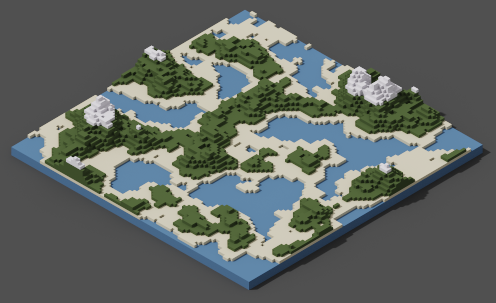

# Tellus
##### Voxel based procedural word generation using Rust

 
Image generated using Tellus and MagicaVoxel

## Work in Progress
This is still under **heavy** development. Meaning everything or anything can
change without a moments notice.

## License

Licensed under either of

- Apache License, Version 2.0 ([LICENSE-APACHE](LICENSE-APACHE) or
  https://www.apache.org/licenses/LICENSE-2.0)
- MIT license ([LICENSE-MIT](LICENSE-MIT) or
  https://opensource.org/licenses/MIT)

at your option.
